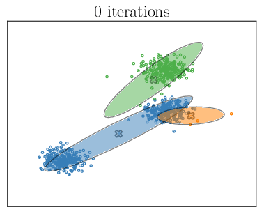

# Gaussian Expectation-Maximization Clustering

We provide the implementation of **Gaussian Expectation-Maximization Clustering** on dummy data using Scikit learn, as well as the code to plot the clusters at different iterations . To run the example simply execute `python ./GMM.py`. The results of K-Means clustering is shown below:

