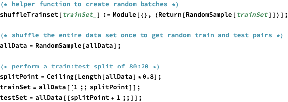

<?xml version="1.0" encoding="UTF-8"?>
<!DOCTYPE html PUBLIC "-//W3C//DTD XHTML 1.1 plus MathML 2.0//EN"
        "HTMLFiles/xhtml-math11-f.dtd">

<!-- Created with the Wolfram Language : www.wolfram.com -->

<html xmlns="http://www.w3.org/1999/xhtml">
<head>
 <link href="HTMLFiles/Mathematica_Example.css" rel="stylesheet" type="text/css" />
</head>

<body>
<a href="http://htmlpreview.github.com/?https://github.com/ruehlef/Physics-Reports/tree/master/Chapter_2/2.1/Mathematica_Example/Mathematica_Example.htm">To display this file properly, open it outside of Github.</a>
  

 Mathematica implementation of the simple NN that classifies bundle stability (cf.Section 2.1)

 Optional : Seed the random number generator for reproducibility

 

 Read in the full data set

 

 Perform a train:test split

 

 Define the NN hyperparameters

 

 Set up the NN

 

 

 Initialize the network

 

 Train the NN

 

 Plot the loss during training

 

 

 

 

 Evaluate the NN

 

 

 

 

 Plot prediction of NN on all data

 

 

 

 <a href="http://www.wolfram.com/language/" style="color:#000; text-decoration:none;">
  Created with the Wolfram Language 
 </a>

</body>

</html>
