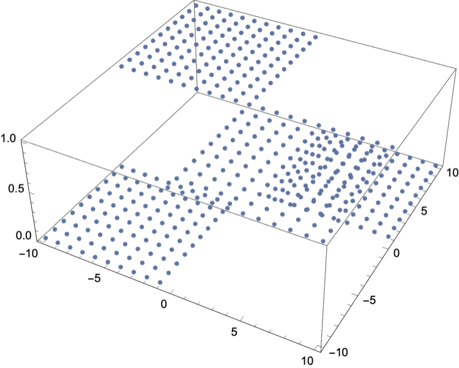

# Chapter 2.1

## Keras example
Run with `python Keras_Example.py` or look at the Jupyter notebook [Keras_Example.ipynb](./Keras_Example/Keras_Example.ipynb).

## Mathematica example
Run the notebook `Mathematica_Example.nb` or look at the html at [Mathematica_Example.htm](Mathematica_Example/Mathematica_Example.htm)

## PyTorch example
Run with `python PyTorch_Example.py` or look at the Jupyter notebook [PyTorch_Example.ipynb](PyTorch_Example/PyTorch_Example.ipynb).

## TensorFlow example
Run with `python TensorFlow_Example.py` or look at the Jupyter notebook [TensorFlow_Example.ipynb](TensorFlow_Example/TensorFlow_Example.ipynb).

