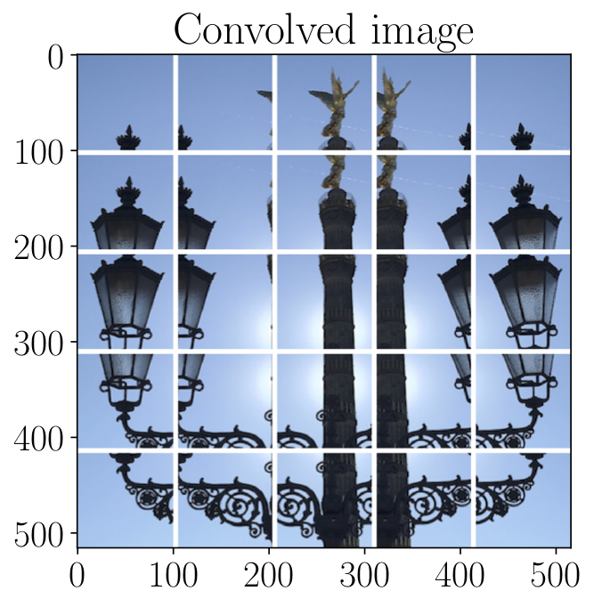
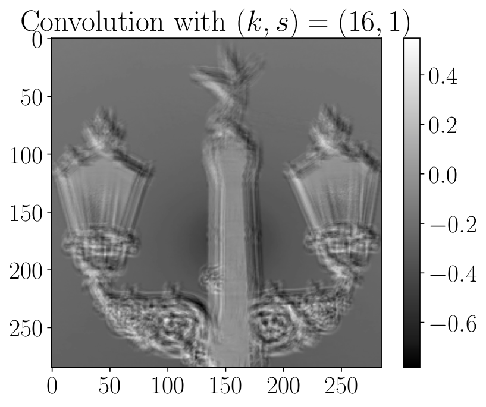
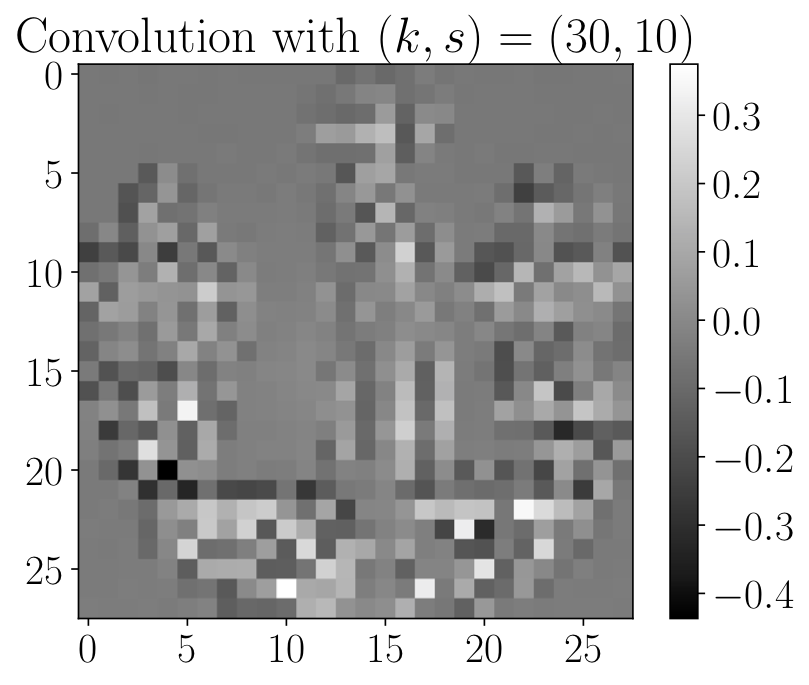
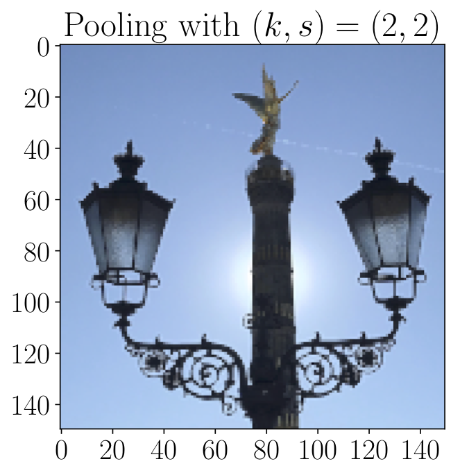
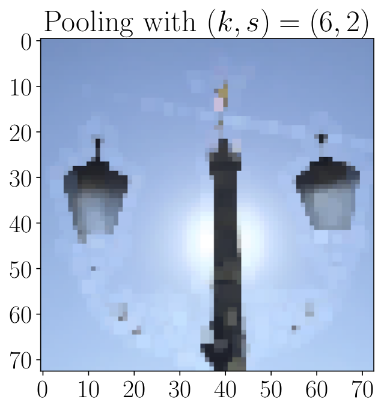

# Chapter 2.4
In chapter 2.4 we illustrate important layers in convolutional neural networks, such as **convolutional  layers**, **pooling layers**, and their respective counterparts. We present here the code  (`CNN_filter_example.py`) used to illustrate these operations in the book. I have used two convolutional layers and two max pooling layers. Feel free to add other ones or to change the parameters of the existing ones to see their effects on the image. The 4 layer definitions are:

```python
	self.conv1 = torch.nn.Conv2d(3, 1, kernel_size=16, stride=1, padding=0)
	self.conv2 = torch.nn.Conv2d(3, 1, kernel_size=30, stride=10, padding=0)
	self.pool1 = torch.nn.MaxPool2d(kernel_size=2, stride=2, padding=0)
	self.pool2 = torch.nn.MaxPool2d(kernel_size=10, stride=4, padding=0)
```

## Strides and kernel sizes
If the stride in any direction is smaller than the kernel size, parts of the image will be read multiple times by the kernel. This is illustrated in the Figure below for 

```python
	kernel_size=100
	stride=50
```





## Covolutions
The effect of covolving an RGB image (over all 3 color channels) for different `stride` and `kernel_size` parameters:




## Max pooling
The effect of max pooling on an RGB image for different `stride` and `kernel_size` parameters:


