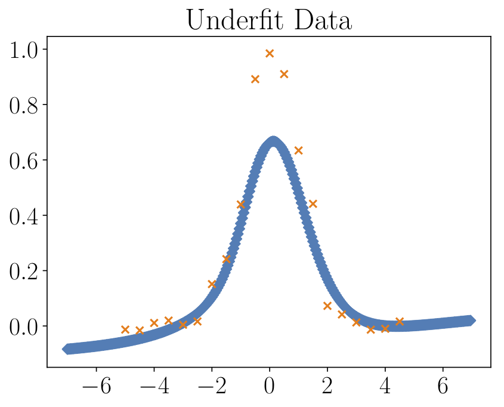
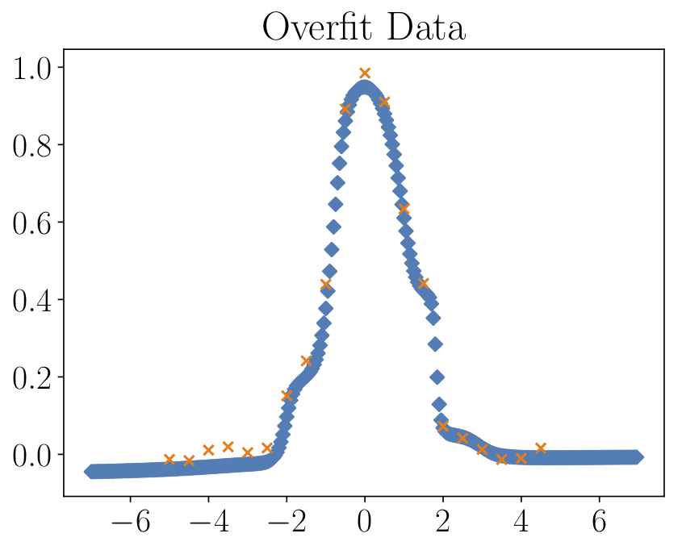
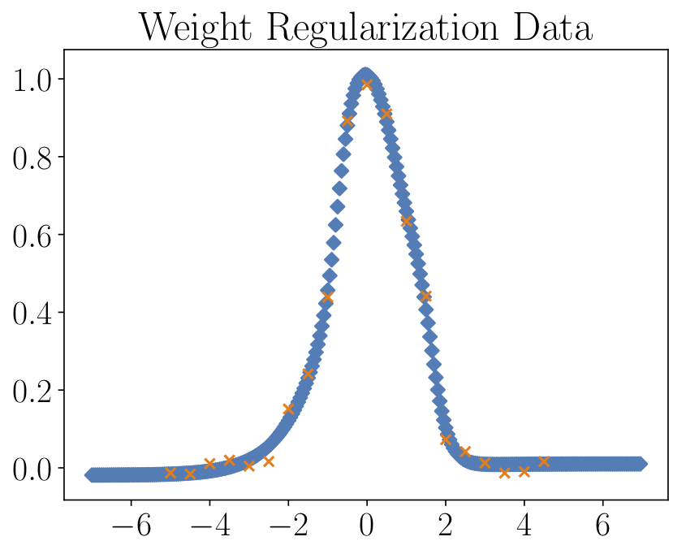

# Chapter 3
In this chapter we illustrate the effect of over- and undertraining, as well as different regularization techniques. Run the code with `python Undertraining_Overtraining_Regularization` or look at the Jupyter notebook [Undertraining\_Overtraining\_Regularization.ipynb](./Undertraining_Overtraining_Regularization.ipynb).

## Undertrained network
We show the original data (orange) and the result of the regressor NN (blue) for an **undertrained network**.

## Overtrained network
We show the original data (orange) and the result of the regressor NN (blue) for an **overtrained network**.

## Dropout regularization
We show the original data (orange) and the result of the regressor NN (blue); overtraining is prevented by using **dropout layers**.

## Weight regularization (L2)
We show the original data (orange) and the result of the regressor NN (blue); overtraining is prevented by using **weight regularization**.

