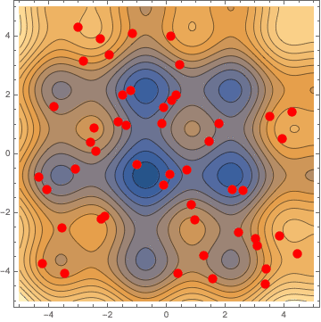
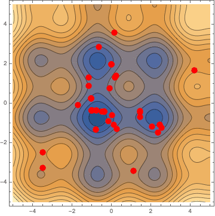
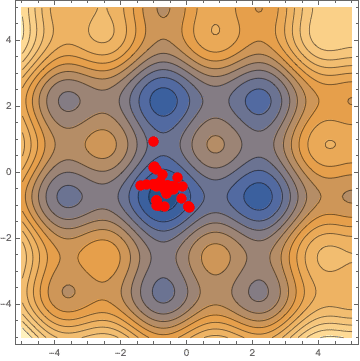

# Chapter 5
We implement a very simple **Genetic Algorithm** to extremize a function in two variables using tournament selection. Run the notebook `GA_Example.nb` or look at <a href="http://htmlpreview.github.com/?http://htmlpreview.github.com/?https://github.com/ruehlef/Physics-Reports/tree/master/Chapter_5/GA_Example.htm">the html</a>.

## Contour plot of the function with the individuals (red dots)
### 1st generation (randomly initialized)

### 2nd generation

### 3rd generation

