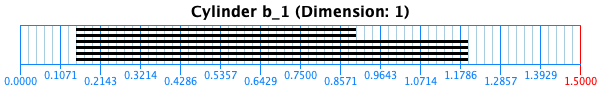

#Chapter 6
In this chapter we illustrate the computation of persistent homology of a point cloud that lies on a cylinder surface in JAVAPLEX. We compute both the persistent homology over a finite field and via a lazy witness complex that randomly select landmark points

## Jython Implementation
The Jython implementation can be found [here](./Jython/). Just run 

```
jython Persistent_Homology_in_Jython.py
```

You will have to set the path to your `javaplex.jar` in the file `Persistent_Homology_in_Jython.py`.


## Java Implementation
The Java implementation can be found [here](./JAVA/). Compile and run with

```
javac -classpath /path/to/javaplex.jar PersistentHomologyInJava.java
java -classpath ':javaplex.jar' PersistentHomologyInJava
```


## Results for finite field
The barcodes for the PH over a finite field are:





## Results for lazy witness
The barcodes for the PH from a lazy witness with random landmark selector are:


