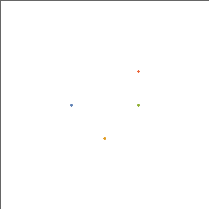

# Voronoi Diagrams

Voronoi diagrams partition a plane into cells based on seed points. Each point in a cell associated with a seed point has the property that it is closer to this seed point than to any other seed point. Boundaries between two cells thus form as equidistant lines between the two seeds of the cell.

In **unsupervised clustering**, points are often assigned to a cluster based on their proximity to the cluster center. Hence, these cluster centers form the seeds of a Voronoi diagram.

The following animation provides an example of how a Voronoi diagram with four seeds and Euclidean distance measure (i.e. equidistant points lie on a circle around the cluster center) form:

