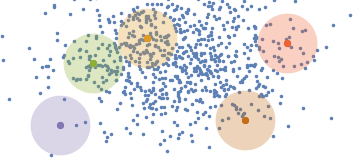

# Mean Shift Clustering

We implement **Mean Shift Clustering** on dummy data using Mathematica from scratch. Skicit learn does provide the algorithmas well, but I wanted to illustratehow the cluster centers move. Simply open `Mean shift.nb` wigth mathematica or look at the [html version](./Mean-shift.htm). The results of K-Means clustering is shown below:

