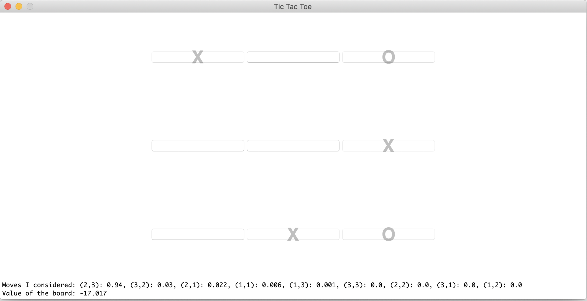

# Chapter 8 - Deep RL
In this chapter we train deep RL agents to learn to play **Tic Tac Toe** tabula rasa, i.e. without any prior knowledge. We use both a **Deep Q Network** and a an **(Asynchronous) Advantage Actor-Critic** with a NN for the policy and state value evaluation.

Both networks are not too bad Tic Tac Toe players, but are also far from perfect players. If you play against them, they are *not* trained further. Furthermore, they act greedily, i.e. they always perform the best next action. This means that once you've found a strategy to beat it, this strategy will work every time. Probably the performance can be improved by training them longer or tune the hyperparameters. I have trained the agents for less than 30 minutes on my laptop.

## A3C
The [A3C implementation](./A3C) uses two NNs. Both have 3 hidden layers with 50 nodes and `tanh` activation. The last layer of the policy network has a 'softmax' activation, while the value network has an `identity` activation.

The two NNs (as plotted by Chainer):
<table>
	<tr>
		<td></td><td></td>
	</tr>
	<tr>
		<td>Policy NN.</td><td>Value function NN.</td>
    </tr>
</table>

### Play against NN
If you want to play against the trained NN, simply execute

```
python TTT_GUI.py
```

The NN will show you the output of the policy and state value NN, i.e. the percentage for each of the 9 actions, as well as an overall score for the board.

<center>

</center>

### Train the NN
The agent was programmed and tested on Chainer 6.0.0, ChainerRL 0.6.0 and gym 0.12.5 with python 3.7.

This Chainer version seems to have (at least) two bugs which you need to fix before you can train the NN. Moreover, I need to access (from the gym environment) the agent that is currently being trained as well as the total number of training steps performed. Fixing the bugs and making this information available requires chaning 3 files in the ChaienrRL package. So you should locate it first. For my setup it is in `~/my_venv/lib/python3.7/site-packages/chainerrl`.

##### 1.) Open `site-packages/chainerrl/wrappers/cast_observation.py` and replace 

```python
def _observation(self, observation)
```

with

```python
def observation(self, observation)
```

i.e. remove the underscore.

##### 2.) Open `site-packages/chainerrl/wrappers/scale_reward.py` 
Replace 

```python
def _reward(self, reward):
```

with

```python
def reward(self, reward):
```

i.e. remove the underscore.

##### 3.) Replace the file `site-packages/chainerrl/experiments/train_agent_async.py` 
Replace it with [train_agent_async.py](./A3C/train_agent_async.py) file from the [A3C directory](./A3C).

##### 4.) Run the training script
Now you can train the agent by going to the A3C directory  and running

```
python train_a3c_gym.py 8
```

The `8` is the number of asynchronous processes (agents). The program will create a directory inside the `a3c_training` subfolder with the date and time of when the process was started and will save the trained network, as well as intermediate scores from evaluation runs there. You can play with many of the parameters by either modifying the default value in the `train_a3c_gym.py` file or by passing the new value as an argument, e.g. `python train_a3c_gym.py 4 --steps 1000000` to run four agents for a million training steps.


## DQN
The [DQN implementation](./DQN) uses a single NN to guess the action value function. The NN has 2 hidden layers with 100 nodes and `ReLU` activation. The last layer has an `identity` activation, i.e. in DQN we do not use a `softmax` activation but simply use the action that has the highest q-value.

The NN (as plotted by Chainer):


### Play against NN
If you want to play against the trained NN, simply execute

```
python TTT_GUI.py
```

The NN will show you the output of the policy NN, i.e. the value of each of the 9 actions.


### Train the NN
The agent was programmed and tested on Chainer 6.0.0, ChainerRL 0.6.0 and gym 0.12.5 with python 3.7.

This Chainer version seems to have (at least) two bugs which you need to fix before you can train the NN. Moreover, I need to access (from the gym environment) the agent that is currently being trained as well as the total number of training steps performed. Fixing the bugs and making this information available requires chaning 3 files in the ChaienrRL package. So you should locate it first. For my setup it is in `~/my_venv/lib/python3.7/site-packages/chainerrl`.

##### 1.) Open `site-packages/chainerrl/wrappers/cast_observation.py` and replace 

```python
def _observation(self, observation)
```

with

```python
def observation(self, observation)
```

i.e. remove the underscore.

##### 2.) Open `site-packages/chainerrl/wrappers/scale_reward.py` 
Replace 

```python
def _reward(self, reward):
```

with

```python
def reward(self, reward):
```

i.e. remove the underscore.

##### 3.) Replace the file `site-packages/chainerrl/experiments/train_agent.py` 
Replace it with [train_agent.py](./DQN/train_agent.py) file from the [DQN directory](./DQN).

##### 4.) Run the training script
Now you can train the agent by changing to the DQN directory and running

```
python train_dqn_gym.py
```

The DQN uses a single agent, wbhich is why it is better to train it on a GPU. At the moment it trains on a CPU. To change this to train it on your GPU (if you have CUDA) run `python train_dqn_gym.py --GPU 0` (or whichever GPU you want to use). You can also change the default value in the file `train_dqn_gym.py` and try many other hyperparamters.
The program will create a directory inside the `dqn_training` subfolder with the date and time of when the process was started and will save the trained network, as well as intermediate scores from evaluation runs there.
