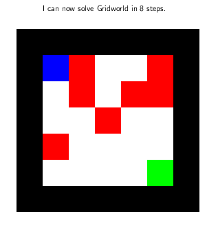

# SARSA

To run the code simply execute `python example.py`. The SARSA implementation is based on <https://github.com/lazyprogrammer/machine_learning_examples/blob/master/rl/sarsa.py>, and the function to display the maze is based on <https://gist.github.com/kfeeeeee/e81aeeff0516cfd7645c8e99cd4fa315#file-gridworld-py>, but I modified it quite a bit. 

The maze is called **Gridworld**, since you can move on a grid. I also [presented this example](https://github.com/jimhalverson/string_data17/tree/master/reinforcement) at a breakoutgroup I was leading on Machine Learning at a [workshop](https://web.northeastern.edu/het/string_data/) at Northeastern University.

## Result
#### Route
Below we illustrate the route through the maze taken by an untrained agent and by an agent that has been trained for 6,000 episodes.

 | 
Untrained worker. Performs essentially a random walk. 4 steps to pitfall. | Same worker trained for roughly 5 seconds (6,000 games). 8 steps to solution.

#### Action-Value
The action-value function Q=Q(s,a) in this case is a 5 x  5 x 4 array, since each of the 5 x 5 grid positions has 4 possible actions (up, down, left, right), and each action has a separate value. In order to illustrate Q, we plot at each grid position of the maze the best next action with an arrow (in case several actions are considered equally good, a random one is chosen). The color coding shows the degree of certainty with which the agent deems this move to be the best.
 |  | 
 |  | 

