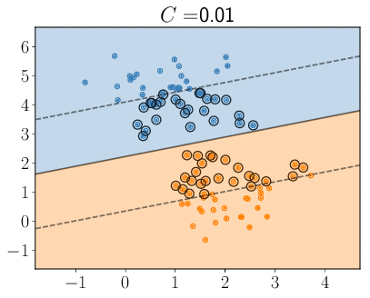

# Support vector machines

## SVM Classifier
We implement a simple SVM classifier with Scikit learn. We classify dummy data in 2D feature space and plot how the support vectors change with changing parameter c. To run the program simply execute `python SVM_Classify.py`, or look at the [Jupyter notebook](./SVM_Classify.ipynb). The change in the support vectors is also summarized in the following gif:

## SVM Kernel trick
We illustrate the SVM Kernel trick with a Mathematica notebook. Just open `SVM_Kernel_Trick.nb` in Mathematica or look at the [html version](./SVM_Kernel_Trick.htm). We use again the example from [Section 2.1](../../Chapter%202/2.1/README.md), where we classify data in a 2D feature space. Data in opposite quadrants belongs to the same class. This is clearly not linearly separable in 2D, so we need to lift it to a higher dimension (3D in this case). The linear decision boundary in 3D becomes non-linear when projected back down to 2D.

